# Mango 自动化测试框架 v3.7.1


**Mango** 是一个企业级自动化测试框架，专为语音识别SDK和相关服务的综合测试而设计。框架采用模块化架构，支持多环境部署，提供了完整的测试生命周期管理，特别是其创新的**NANO测试套件**，基于DSL（领域特定语言）驱动，实现了测试逻辑与代码的完全分离。

## 🌟 核心特性

### 🎯 DSL驱动的NANO测试套件
- **声明式语法**: 使用简洁直观的DSL语法定义复杂测试流程
- **动态执行**: 无需重编译，修改DSL文件即可调整测试逻辑
- **多客户端协作**: 支持TSA、SET、VOI、OMS、TTS、SYS、EXP、HWK、PST、TIA、CPL、NIS、NSE、ENR、PIS、TSS、TSR等多种客户端类型
- **智能断言系统**: 60+种回调/API断言、4种文件断言、LOG断言
- **多级数据驱动**: 全局CSV、Case级CSV（`PARAMETER`语法），支持 `PARAMETERS` 多值压缩列降低 CSV 维护成本

### 🏗️ 企业级测试架构
- **多项目支持**: 支持24mm/mp、24mm/ota1~3、BEV、PSTT、Seres、PSL、Nissan、Thai、Titan、800D、PISA等多种项目环境
- **分布式执行**: 基于pytest-xdist的多进程并发测试，支持智能并发调度
- **自动重试机制**: 内置失败用例重试策略，提高测试稳定性
- **完整报告体系**: 集成Allure报告，支持微信通知，自动生成ASR/唤醒/回调CSV报告

### 🤖 大模型全双工测试（新）
- **PIS客户端**: 支持PISA大模型全双工WebSocket测试
- **LLM断言**: 通过TSR客户端提供LLM对话结果统计与分析
- **对话记录**: 自动记录每个Case的PIS大模型对话汇总到JSONL文件

### 🔧 灵活的配置管理
- **动态依赖下载**: 集成Jenkins和FTP自动下载器，支持多版本库管理
- **环境自动部署**: 智能环境检测和服务拉起机制
- **智能并发调度**: 根据CPU空闲率动态扩容，支持严格标签的并发上限
- **GDB调试支持**: 完整的断点调试功能，支持服务和客户端进程调试

---

## 📁 项目结构

```
mango/
├── 📁 conf/                             # 配置文件目录
│   ├── mango.ini                        # 主配置文件（Jenkins、FTP、项目、并发调度配置）
│   └── assert_key_value.yaml            # 断言key-value配置文件
├── 📁 data/                             # 数据目录
│   └── mango.db                         # SQLite数据库（TTS文言管理）
├── 📁 doc/                              # 项目级文档
├── 📁 docker/                           # Docker相关文件
│   ├── build_image.sh                   # 基础镜像构建脚本（mango:vX.Y.Z）
│   ├── build_whole.sh                   # 整体镜像构建脚本（mango-app:vX.Y.Z）
│   ├── 📁 image/                        # 基础镜像构建资源（dockerfile/依赖注入）
│   └── 📁 whole/                        # 整体镜像构建资源（Dockerfile/Run_Docker.py）
├── 📁 src/                              # 源代码目录
│   ├── 📁 core/                         # 核心模块
│   │   ├── BaseTestCase.py              # 测试基类（含ThresholdFlushBuffer日志缓冲）
│   │   ├── Reporter.py                  # 测试报告生成器（CSV/JSONL）
│   │   └── 📁 Status/                   # 服务状态管理
│   │       ├── AIBSSessionStatus.py
│   │       ├── HawkDecoderStatus.py
│   │       └── SpeechEngineStatus.py
│   ├── 📁 include/                      # C++ SDK头文件
│   │   ├── aibs_client_api.h
│   │   ├── aibs_client_nissan_api.h
│   │   ├── aibs_server_api.h
│   │   ├── ota_client_api.h
│   │   ├── speech_engine_api.h
│   │   └── speech_engine_server_api.h
│   ├── 📁 testsuite/                    # 测试套件目录
│   │   └── 📁 NANO/                     # NANO测试套件（DSL驱动）
│   │       ├── test_nano.py             # NANO测试入口（TestNANO类）
│   │       ├── dsl_engine.py            # DSL语法解析引擎（DSLEngine/DSLCase/DSLCommand）
│   │       ├── config.py               # NANO配置（CLIENT_COMMANDS/ENVIRONMENT_VARIABLES）
│   │       ├── 📁 runner/               # 执行引擎层
│   │       │   ├── NANORunner.py        # 主执行引擎
│   │       │   └── SystemManager.py     # 系统操作管理（PULL/KILL/CMD等）
│   │       ├── 📁 client/               # 客户端层（工厂模式）
│   │       │   ├── ClientFactory.py     # 客户端工厂
│   │       │   ├── NANOClientManager.py # 客户端生命周期管理
│   │       │   ├── AIBSClient.py        # AIBS语音服务客户端（TSA/SET/VOI/OMS/TTS）
│   │       │   ├── NissanAIBSClient.py  # 日产AIBS客户端（NIS/NSE）
│   │       │   ├── SpeechEngineClient.py# SpeechEngine离线识别/唤醒（HWK）
│   │       │   ├── PSTTClient.py        # PSTT在线ASR服务（PST）
│   │       │   ├── AITiTan.py           # TiTan WebSocket ASR（TIA）
│   │       │   ├── CarPlayClient.py     # CarPlay SDK客户端（CPL）
│   │       │   ├── EcnrClient.py        # ECNR降噪引擎客户端（ENR）
│   │       │   ├── PISALLMClient.py     # PISA大模型全双工WebSocket（PIS）
│   │       │   ├── TSSClient.py         # 电信智慧屏客户端（TSS）
│   │       │   ├── TSRClient.py         # Suite级统计报告客户端（TSR）
│   │       │   └── AudioDataMixin.py    # 音频数据发送混入
│   │       ├── 📁 assertion/            # 断言验证层
│   │       │   ├── AssertionDataManager.py # 断言数据管理器
│   │       │   ├── AssertionEngine.py   # 断言执行引擎
│   │       │   ├── AssertionParser.py   # 断言语法解析器
│   │       │   └── ValueMatcher.py      # 值匹配器
│   │       ├── 📁 tools/                # 工具层
│   │       │   ├── event_parser.py      # 事件文件解析器
│   │       │   ├── upload_manager.py    # 文件上传管理器
│   │       │   └── 📁 tsr/              # TSR指令实现（装饰器自动注册）
│   │       │       ├── base.py          # TSR基类与注册装饰器
│   │       │       ├── asr_accuracy.py  # ASR准确率统计
│   │       │       ├── asr_language.py  # ASR语言统计
│   │       │       ├── delay.py         # 延迟测试统计
│   │       │       ├── wakeup_accuracy.py # 唤醒准确率统计
│   │       │       ├── vad_accuracy.py  # VAD准确率统计
│   │       │       ├── vad_precision.py # VAD精度统计
│   │       │       ├── time_boundary_accuracy.py # 时间边界准确率
│   │       │       └── llm.py           # LLM对话结果统计
│   │       └── 📁 doc/                  # NANO详细文档
│   │           ├── README.md            # NANO总说明文档
│   │           ├── COMMAND.md           # DSL指令说明手册
│   │           ├── EXPECT.md            # 断言系统说明
│   │           ├── ENV.md               # 环境变量系统说明
│   │           ├── FIXTURE.md           # Fixture前后置说明
│   │           ├── LOG_ASSERTION.md     # LOG断言说明
│   │           ├── TSR.md               # TSR客户端说明
│   │           └── NLU测试用例编写指南.md
│   ├── 📁 userInterface/                # 用户接口层
│   │   ├── run_test.py                  # 主测试运行器（AtomicSuite管理）
│   │   ├── parse_config.py              # 配置文件解析器
│   │   ├── process_result.py            # 结果处理与报告生成
│   │   ├── deploy_environment.py        # 环境部署管理
│   │   └── mongo_assert.py             # MongoDB断言工具
│   └── 📁 utils/                        # 工具库
│       ├── common.py                    # 通用工具函数
│       ├── ConfigParser.py              # mango.ini配置解析器
│       ├── file_reader.py               # 文件读取工具
│       ├── FTPDownloader.py             # FTP下载器
│       ├── JenkinsDownloader.py         # Jenkins构建下载器
│       ├── jsonUtil.py                  # JSON路径解析工具
│       ├── MangoDB.py                   # SQLite TTS数据库管理
│       ├── audio_rms_calculate.py       # 音频RMS计算
│       └── send_wechat.py               # 企业微信通知
├── 📁 tools/                            # 外部工具脚本
│   ├── asr_analyze_results.py           # ASR结果分析
│   ├── audio_duration_calculator.py     # 音频时长计算
│   ├── fota_diff_package_generator.py   # FOTA差分包生成
│   ├── generate_fa_voiceprint_cases.py  # FA声纹用例生成
│   ├── log2mgo_converter.py             # Log转MGO格式转换器
│   ├── plot_mem_rt.py                   # 内存/响应时间绘图
│   ├── tts_synth_tool.py                # TTS合成工具
│   ├── yaml2mgo_converter.py            # YAML转MGO转换器
│   ├── yaml_wakeup_to_mgo_converter.py  # 唤醒YAML转MGO转换器
│   └── 📁 wakeup/                       # 唤醒相关工具
├── 📄 Run_Mongo.py                      # 主启动脚本（命令行入口）
├── 📄 Run_Docker.py                     # Docker模式启动脚本
├── 📄 GDB.sh                            # GDB调试辅助脚本
├── 📄 conftest.py                       # pytest全局配置与钩子
└── 📄 pytest.ini                       # pytest配置文件
```

---

## 🚀 快速开始

### 环境要求
- **Python**: 3.6+
- **操作系统**: Linux (x86, CentOS 7+)
- **依赖库**: pytest, allure-pytest, loguru, psutil, pytest-xdist, pytest-rerunfailures
- **C++ SDK**: 相关语音服务动态库文件（通过Jenkins/FTP下载）

### 安装依赖
```bash
pip3 install pytest allure-pytest loguru psutil pytest-xdist pytest-rerunfailures
```

### 基础使用

#### 1. 运行NANO测试套件
```bash
# 基础运行（单进程）
python3 Run_Mongo.py -f NANO \
  -C TestCase/conf/decoder.conf \
  -a TestCase/caselist/nano.mgo \
  -b 24mm/ota2

# 多进程并发运行
python3 Run_Mongo.py -f NANO \
  -C TestCase/conf/decoder.conf \
  -a TestCase/caselist/nano.mgo \
  -b 24mm/ota2 \
  -n 5

# 全局CSV参数化
python3 Run_Mongo.py -f NANO \
  -C TestCase/conf/decoder.conf \
  -a TestCase/caselist/nano.mgo \
  -b 24mm/ota2 \
  -P TestCase/data/test_data.csv

# 参数化行过滤（只跑CSV第10-20行）
python3 Run_Mongo.py -f NANO ... -P data.csv -PF 10-20

# 动态步骤参数化
python3 Run_Mongo.py -f NANO ... -S steps.csv
```

#### 2. 下载依赖库
```bash
# 下载最新构建
python3 Run_Mongo.py -J "new" -b 24mm/ota2

# 下载指定版本
python3 Run_Mongo.py -J "TSPSpeechEngine:123,LCSEngine:456" -b 24mm/ota2

# 从FTP下载
python3 Run_Mongo.py -D 0   # 全部下载
python3 Run_Mongo.py -D 1   # 仅音频文件
python3 Run_Mongo.py -D 2   # 仅资源文件
```

#### 3. GDB调试模式
```bash
python3 Run_Mongo.py -f NANO -g \
  -C TestCase/conf/decoder.conf \
  -a TestCase/caselist/nano.mgo
```

#### 4. Docker镜像打包
```bash
# 打包Mango运行环境基础镜像（包含 Python 依赖与 Allure 环境）
./docker/build_image.sh v3.6.0

# 打整体镜像（基于 mango:v3.6.0，拷贝框架代码）
./docker/build_whole.sh v3.6.0
```

说明：
- `build_image.sh` 产物是 `mango:v3.6.0`
- `build_whole.sh` 产物是 `mango-app:v3.6.0`
- 先执行基础镜像，再执行整体镜像

---

## 🎯 NANO测试套件详解

NANO是Mango框架的核心，基于DSL语言驱动的测试套件。

### DSL语法结构

#### 四种块类型
```
>>> SETUP          ← Session级别前置（每个并发Worker执行一次）
...
<<<

>>> TEARDOWN       ← Session级别后置（每个并发Worker执行一次）
...
<<<

>>> SUITE_TEARDOWN ← Suite级别后置（只在主进程执行一次）
...
<<<

>>> PARAMETER 123.csv ← 普通测试用例（可指定数据参数化文件）
...
<<<
```

#### 完整示例
```yaml
>>> SETUP
[SYS]PULL AIBSServer cmn {"brand":"0"}
[SYS]PULL LCSEngine cmn
[TSA]CREATE cmn com.autoai.vr.service_vrassistant
<<<

>>> 1
# 测试天气查询
[TSA]START 1
[TSA]DATA TestCase/audio/weather.pcm
[EXP]NLPResult skill:WEATHER;intention:QUERY <timeout=5>
[TSA]STOP
<<<

>>> TEARDOWN
[TSA]FREE
[SYS]KILL LCSEngine
[SYS]KILL AIBSServer
<<<

>>> SUITE_TEARDOWN
[TSR]ASR_ACCURACY output/asr_report.xlsx
<<<
```

### 数据驱动测试（三级参数化）

#### 1. 全局CSV参数化（`-P`参数）
所有包含 `${variable}` 占位符的用例都会展开：
```yaml
>>> SETUP
[SYS]PULL AIBSServer ${LANGUAGE} {"brand":"0"}
[TSA]CREATE ${LANGUAGE} com.autoai.vr.service_vrassistant
<<<

>>>
[TSA]START 1
[TSA]TEXT ${text}
[EXP]NLPResult skill:${skill};intention:${intention} <timeout=2>
[TSA]STOP
<<<
```
```csv
# test_data.csv
text,skill,intention,LANGUAGE
打电话给张三,Phone,CALL,cmn
导航到公司,Navigation,NAVI,cmn
播放周杰伦的歌,Music,PLAY,cmn
```

#### 2. Case级CSV参数化（`PARAMETER`语法）
```yaml
>>> PARAMETER TestCase/data/case1_data.csv
# 此用例只使用 case1_data.csv
[TSA]TEXT ${text}
[EXP]NLPResult skill:${skill}
<<<

>>> PARAMETER default
# 此用例显式使用全局CSV（-P参数指定的）
[TSA]TEXT ${text}
<<<
```

#### 3. PARAMETERS 多值压缩列（CSV降维）
当 MGO 文件需要兼容多个场景、参数变量越来越多时，CSV 会因列数膨胀而难以维护。`PARAMETERS` 特殊列可以将多个参数压缩到一列中，格式为 `key1:value1;key2:value2;...`，引擎在加载时自动展开合并到行数据里，MGO 文件的 `${variable}` 占位符写法不需要做任何改变。
```csv
# test_data.csv（使用 PARAMETERS 列减少列数）
text    skill    PARAMETERS
打电话给张三    Phone    intention:CALL    LANGUAGE:cmn;timeout:3
导航到公司    Navigation    intention:NAVI    LANGUAGE:cmn;timeout:2
播放周杰伦的歌    Music    intention:PLAY    LANGUAGE:cmn;timeout:2
```

对应的 MGO 文件：
```yaml
>>>
[TSA]CREATE ${LANGUAGE}
[TSA]START 1
[TSA]TEXT ${text}
[EXP]NLPResult skill:${skill};intention:${intention} <timeout=${timeout}>
[TSA]STOP
<
```
**合并优先级（高→低）**：普通列 > `PARAMETERS` 列内的 key > `@头部参数`

若值中含有字面量分号和冒号，用 `\;`, 以及 `\:` 转义：
```csv
PARAMETERS
links:http\://www.baidu.com;LANGUAGE:cmn
```

当所有行参数可以合并在一起时，`PARAMETERS` 也可以写在 `@头部参数` 区域，作用于整个 CSV 文件每一行的默认值：
```csv
@PARAMETERS: LANGUAGE:cmn;timeout:3

text    skill    intention
打电话给张三    Phone    CALL
导航到公司    Navigation    NAVI
```


---

## 🔌 客户端系统

### 客户端类型总览

| 客户端 | 标识 | 说明 |
|--------|------|------|
| AIBSClient | TSA / SET / VOI / OMS / TTS | 标准AIBS语音助手服务 |
| NissanAIBSClient | NIS / NSE | 日产定制AIBS客户端 |
| SpeechEngineClient | HWK | SpeechEngine离线识别与唤醒 |
| PSTTClient | PST | PSTT在线ASR服务 |
| AITiTan | TIA | TiTan WebSocket ASR |
| CarPlayClient | CPL | CarPlay SDK |
| EcnrClient | ENR | ECNR降噪引擎 |
| PISALLMClient | PIS | PISA大模型全双工WebSocket（新） |
| TSSClient | TSS | 电信智慧屏AIBS客户端 |
| TSRClient | TSR | Suite级统计报告（新） |
| SystemManager | SYS | 系统操作（非客户端） |
| AssertionEngine | EXP | 断言验证（非客户端） |

### 客户端工厂模式
所有客户端通过 `ClientFactory` 统一创建，`NANOClientManager` 负责生命周期管理（创建、复用、清理）。

---

## ✅ 断言系统

### 断言类型

**回调断言**（等待异步回调数据匹配）
```
[EXP]NLPResult skill:WEATHER;intention:QUERY <timeout=5>
[EXP]cloudASRResult text:今天天气怎么样 <timeout=3>
[EXP]SpeechWakeup text:你好小智 <timeout=10>
[EXP]CarPlayWakeup text:Hey Siri <timeout=5>
```

**API断言**（同步验证接口返回值）
```
[EXP]CREATE_RET 0
[EXP]START_RET 0
[EXP]SETVRCONFIG_RET 0
[EXP]GET_VERSION_RET 0
```

**文件断言**
```
[EXP]FILEEXIT /path/to/file.wav         # 文件存在
[EXP]FILESIZE /path/to/file.wav 1024    # 文件大小
[EXP]FILEMD5 /path/to/file.wav abc123   # MD5校验
[EXP]FILEDIF /path/to/result.json key:value  # JSON内容比对
```

**LOG断言**（从日志文件中匹配关键字）
```
[EXP]LOG keyword <timeout=3>
```

**SUM汇总断言**
```
[EXP]SUM passed_count:10;failed_count:0
```

### 超时机制
所有回调断言支持 `<timeout=X>` 语法，底层使用信号量机制异步等待，不阻塞其他操作。`timeout=-1` 表示无限等待。

---

## 📊 TSR（Suite报告）系统

TSR是Suite级别的统计和报告系统，在 `>>> SUITE_TEARDOWN` 块中使用，只在主进程执行一次。

TSR指令通过装饰器自动注册，新增指令只需在 `src/testsuite/NANO/tools/tsr/` 目录下添加文件并使用 `@register_tsr_command` 装饰器。

| TSR指令 | 说明 |
|---------|------|
| `ASR_ACCURACY` | ASR识别准确率统计，输出Excel报告 |
| `ASR_LANGUAGE` | ASR语言分布统计 |
| `DELAY` | 延迟时间测试统计 |
| `WAKEUP_ACCURACY` | 唤醒准确率统计 |
| `VAD_ACCURACY` | VAD准确率统计 |
| `VAD_PRECISION` | VAD精度统计 |
| `TIME_BOUNDARY_ACCURACY` | 时间边界准确率 |
| `LLM` | LLM大模型对话结果统计 |
| `PSTT_ACCURACY` | PSTT测试集综合统计 |

---

## 🏗️ 系统架构



```
┌─────────────────────────────────────────────────────────────────┐
│                    Mango测试框架整体架构                           │
├─────────────────────────────────────────────────────────────────┤
│  🎯 用户接口层 (User Interface Layer)                             │
│  ├── Run_Mongo.py: 命令行入口，参数解析，Suite调度                 │
│  ├── run_test.py: AtomicSuite管理，多Suite并发线程池               │
│  ├── parse_config.py: 配置解析器                                  │
│  └── process_result.py: 结果处理、Allure报告生成                  │
├─────────────────────────────────────────────────────────────────┤
│  🧪 测试套件层 (Test Suite Layer)                                │
│  ├── BaseTestCase.py: 测试基类（fixture/日志缓冲/失败附件）        │
│  └── NANO测试套件:                                               │
│      ├── test_nano.py: Pytest入口，回调注册，Session管理           │
│      └── dsl_engine.py: DSL解析引擎（三级参数化，行过滤）          │
├─────────────────────────────────────────────────────────────────┤
│  ⚙️ 执行层 (Execution Layer)                                     │
│  ├── NANORunner: 主执行引擎，指令路由                              │
│  ├── SystemManager: SYS指令实现（PULL/KILL/CMD/UPLOAD等）         │
│  ├── ClientFactory: 客户端工厂（工厂模式）                         │
│  └── NANOClientManager: 客户端生命周期管理                         │
├─────────────────────────────────────────────────────────────────┤
│  🔌 客户端层 (Client Layer)                                       │
│  ├── AIBSClient (TSA/SET/VOI/OMS/TTS): 标准语音服务               │
│  ├── NissanAIBSClient (NIS/NSE): 日产定制客户端                   │
│  ├── SpeechEngineClient (HWK): 离线识别/唤醒                      │
│  ├── PSTTClient (PST) / AITiTan (TIA): 在线ASR                  │
│  ├── CarPlayClient (CPL): CarPlay SDK                            │
│  ├── EcnrClient (ENR): ECNR降噪引擎                              │
│  ├── PISALLMClient (PIS): 大模型全双工WebSocket（新）             │
│  ├── TSSClient (TSS): 电信智慧屏AIBS客户端                        │
│  └── TSRClient (TSR): Suite级统计报告（新）                       │
├─────────────────────────────────────────────────────────────────┤
│  ✅ 断言层 (Assertion Layer)                                      │
│  ├── AssertionDataManager: 回调数据收集与管理                      │
│  ├── AssertionEngine: 断言执行引擎（回调/API/文件/LOG/SUM）        │
│  ├── AssertionParser: 断言语法解析                                 │
│  └── ValueMatcher: 值匹配（精确/模糊/正则）                        │
├─────────────────────────────────────────────────────────────────┤
│  🔧 工具服务层 (Tool & Service Layer)                             │
│  ├── JenkinsDownloader: 自动构建下载                               │
│  ├── FTPDownloader: FTP文件下载                                   │
│  ├── MangoDB: SQLite TTS文言数据库管理                             │
│  ├── Reporter: CSV/JSONL报告生成器                                 │
│  └── TSR工具集: asr/delay/wakeup/vad/llm统计（装饰器注册）         │
├─────────────────────────────────────────────────────────────────┤
│  🎮 外部系统集成 (External Integration)                            │
│  ├── C++ SDK: 语音识别服务动态库（ctypes调用）                     │
│  ├── Jenkins: 持续集成构建系统                                     │
│  ├── FTP Server: 文件资源服务器                                    │
│  ├── Allure: 测试报告系统                                          │
│  └── 企业微信: 消息通知                                            │
└─────────────────────────────────────────────────────────────────┘
```

---

## 📊 功能统计

### NANO测试套件
| 类别 | 数量 | 详细 |
|------|------|------|
| **客户端类型** | 15种 | TSA/SET/VOI/OMS/TTS/HWK/PST/TIA/CPL/NIS/NSE/ENR/PIS/TSS/TSR |
| **API断言类型** | 60+种 | CREATE_RET/START_RET/SETVRCONFIG_RET/SET_PARAM_RET等 |
| **文件断言类型** | 4种 | FILEEXIT/FILESIZE/FILEMD5/FILEDIF |
| **其他断言** | 2种 | LOG/SUM |
| **TSR指令** | 9种 | ASR/DELAY/WAKEUP/VAD/LLM/PSTT等统计 |
| **环境变量** | 18个 | 路径/配置/元数据/动态生成 |
| **SYS系统指令** | 10个 | PULL/KILL/SLEEP/CMD/UPLOAD/ALLURE/FOTA_RANDOM_ZIP等 |
| **参数化模式** | 3级 | 全局CSV / Case级CSV / 动态步骤CSV |
| **Case块类型** | 4种 | SETUP/TEARDOWN/SUITE_TEARDOWN/TEST |

### 框架整体
| 类别 | 值 | 说明 |
|------|-----|------|
| **支持项目环境** | 13种 | 24mm/mp~ota3、bev、pstt、seres、psl、nissan、thai、titan、800d、pisa |
| **下载器类型** | 2种 | Jenkins构建下载、FTP文件下载 |
| **报告输出** | 4种 | Allure HTML、CSV（ASR/唤醒）、JSONL（回调/PIS对话）、企业微信 |
| **并发模式** | 动态调度 | 基于CPU空闲率的动态扩容 + 严格标签并发上限 |
| **调试模式** | GDB/Valgrind | 完整断点调试，内存泄漏检测 |

---

## 🔧 配置管理

### 主配置文件 (conf/mango.ini) 结构

```ini
# Jenkins服务器配置
[jenkins:TSPSpeechEngine]
user = ...
url = http://jenkins.pachira.cn/view/TSP/job/TSPSpeechEngine

# 依赖库配置
[artifact:24mm-aibs]
jenkins = TSPSpeechEngine
artifacts = artifact/package/AIBS/x86-linux/...

# 项目配置（lib目录+依赖组合）
[project:24mm/ota2]
lib_path = lib/24mm
dependencies = 24mm-aibs, 24mm-lcs-2

# 智能并发调度配置（新）
[Concurrency]
global_max_workers = 10       # 全局默认最大并发数
min_cases_per_worker = 30     # 单进程最小用例数
strict_tags = CP,ONLINE       # 严格遵守并发上限的标签
target_cpu_idle = 50.0        # 触发动态扩容的CPU空闲率阈值
max_dynamic_workers = 20      # 动态扩容后的最大并发极限

# FTP服务器
[FTPServer]
host = 10.54.0.15
port = 21

# MangoDB SQLite数据库（TTS文言）
[MangoDB]
db_file = data/mango.db

[MangoDB.24mm/ota2]
db_table = TTS_24MM_OTA_2
tts = ./data/V5.2.1_xxx.xlsx

# NANO事件文件路径
[NANOEvents]
input = TestCase/caselist/MongoCase/events/InputEvent
callback = TestCase/caselist/MongoCase/events/CallBackEvent

# Bug等级配置
[MangoBugGrade]
S = blocker
A = critical
B = normal
C = minor
D = trivial
```

---

## 🌐 环境变量系统（18个）

| 变量名 | 类型 | 说明 |
|--------|------|------|
| `{WORKPATH}` | 路径 | Suite工作目录 |
| `{ROOTPATH}` | 路径 | 项目根目录 |
| `{WORKSPACE}` | 路径 | 工作空间路径 |
| `{BASEPATH}` | 路径 | Worker进程目录（并发时） |
| `{LIBPATH}` | 路径 | 动态库文件目录 |
| `{CASEPATH}` | 路径 | 用例目录路径 |
| `{LOGPATH}` | 路径 | 日志输出路径 |
| `{SOCKETPATH}` | 路径 | Socket端口文件路径 |
| `{CONFIGPATH}` | 配置 | decoder配置文件路径 |
| `{CARPLAYCONFIG}` | 配置 | CarPlay配置文件路径 |
| `{LCSCONFIG}` | 配置 | LCS配置文件路径 |
| `{CASELIST}` | 配置 | 用例文件路径 |
| `{PARAMETERIZEDATA}` | 配置 | 参数化数据文件路径 |
| `{SUITEID}` | 元数据 | Suite ID |
| `{SUITENAME}` | 元数据 | Suite名称 |
| `{CASEID}` | 元数据 | CaseID 名称 |
| `{UUID}` | 动态 | 每次调用生成新的随机UUID |
| `{TIMESTAMP}` | 动态 | 当前时间戳 |
| `{NOW}` | 动态 | 当前日期时间 |

动态表达式：`{EVAL:python_expression}` 支持任意Python表达式。

---

## 🚀 高级功能

### 1. 行过滤（`-F`）
仅执行指定行号范围内的用例，SETUP/TEARDOWN自动包含：
```bash
python3 Run_Mongo.py -f NANO ... -F 10-20
```

### 2. 参数化行过滤（`-PF`）
对CSV数据文件按文件行号过滤（含@参数行、表头行计入行号）：
```bash
python3 Run_Mongo.py -f NANO ... -P data.csv -PF 5-15
```

### 3. 失败自动附件
测试失败时，如果环境变量 `SAVE_LOG_OPTION=True`，自动将SDK日志目录打包ZIP附加到Allure报告。

### 4. Session级回调过滤
AIBS回调自动过滤以下污染数据：
- `channelID == -1` 的回调
- `skill=VPA_ACTION` 或 `intention=VPA_ACTION/SceneSleep` 的NLPResult

### 5. PIS大模型测试
```yaml
>>> SETUP
[PIS]CREATE ws://pisa.server.cn cmn
[PIS]AIBSServer cmn {"brand":"0"}
[PIS]AIBS_SET_CARTYPE 0
[PIS]AIBS_CREATE cmn com.autoai.vr
[PIS]START
<<<

>>>
[PIS]AIBS_START 1
[PIS]DATA TestCase/audio/question.pcm
[PIS]WAIT ResponseTTS <timeout=10>
[EXP]ResponseTTS tts:今天天气
[PIS]AIBS_STOP
<<<

>>> SUITE_TEARDOWN
[TSR]LLM output/llm_report.xlsx
<<<
```

### 6. 智能并发调度
根据 `[Concurrency]` 配置，框架自动决定并发数：
- 标注 `CP` / `ONLINE` 等严格标签的Suite不会超过配置上限
- CPU空闲率超过 `target_cpu_idle` 时，自动突破默认上限进行动态扩容

---

## 📈 测试报告

### 自动生成的报告文件
| 文件 | 格式 | 说明 |
|------|------|------|
| `asr.csv` | CSV | 每条ASR识别结果（文本/通道/时间/置信度） |
| `wakeup.csv` | CSV | 每条唤醒检测结果（文本/相对时间戳） |
| `callback.jsonl` | JSONL | 全量非污染回调数据（含client/type/data） |
| `pisa_llm_result.jsonl` | JSONL | PIS大模型对话汇总（含case.index） |

### Allure报告
```bash
# 查看报告（实时）
allure serve workspace/allure_result/

# 生成静态报告
allure generate workspace/allure_result/ -o allure_report --clean
allure open allure_report -p 8889
```

Allure报告包含：
- Epic（Solution）/ Feature（Scene）/ Story（Suite）三级层级组织
- 每个用例的完整执行命令（可直接复制重跑单条用例）
- 参数化用例的参数表格展示
- 失败用例自动附加SDK日志ZIP包
- environment.properties 展示各Suite通过率（通过率≥90%为 ✅PASS）

---

## 🛠️ 开发和扩展

### 添加新的TSR指令
1. 在 `src/testsuite/NANO/tools/tsr/` 下新建Python文件
2. 使用 `@register_tsr_command("YOUR_COMMAND")` 装饰器注册
3. 继承 `BaseTSRCommand` 并实现 `execute()` 方法
4. 在 `config.py` 的 `CLIENT_COMMANDS['TSR']` 中添加指令名
5. 更新 `doc/TSR.md` 文档

### 添加新的客户端
1. 在 `src/testsuite/NANO/client/` 下新建客户端文件
2. 在 `ClientFactory.py` 中注册新客户端类型
3. 在 `config.py` 的 `CLIENT_COMMANDS` 中定义支持的指令
4. 在 `test_nano.py` 中注册对应的回调函数
5. 在 `NANORunner.py` 中添加指令路由逻辑

### 添加新的断言类型
1. 在 `config.py` 的 `AssertCodeTypeList` 中注册
2. 在 `AssertionEngine.py` 中实现断言逻辑
3. 在 `conf/assert_key_value.yaml` 中配置解析规则（如需要）
4. 更新 `doc/EXPECT.md` 文档

### 添加新的项目环境
1. 在 `conf/mango.ini` 中添加 `[jenkins:xxx]`、`[artifact:xxx]`、`[project:xxx]` 配置节
2. 如需TTS文言支持，添加 `[MangoDB.project_name]` 配置节
3. 如果是LCS依赖项目，在 `run_test.py` 的 `LCS_PROJECT_ENVIRONMENTS` 中添加

---

## 🔍 故障排查

**动态库加载失败**
```bash
ls -la lib/24mm/
chmod +x lib/24mm/*
python3 Run_Mongo.py -J "new" -b 24mm/ota2
```

**服务启动失败**
```bash
netstat -tlnp | grep <port>
pkill -f "AIBSService|LCSEngine|SpeechEngine"
```

**参数化CSV解析失败**
- 检查CSV文件头部 `@参数名: 值` 格式是否正确
- 注意 `-PF` 行号计数包含 `@` 参数行和表头行
- 检查占位符语法：`${variable}` 而非 `{variable}`

**并发测试数据污染**

- 为网络敏感用例打 `ONLINE` 标签，配置到 `strict_tags`
- 确认各Suite使用独立缓存目录（框架自动处理）
- 检查回调过滤逻辑，确认 `channelID != -1`

---

## 📝 最佳实践

### DSL用例编写规范
- 使用 `SETUP/TEARDOWN` 避免在每个用例中重复初始化服务
- 为所有回调断言设置合理的 `<timeout=X>`，避免用例卡死
- 优先使用 `{WORKPATH}`、`{LIBPATH}` 等环境变量提高可移植性
- 使用 `SUITE_TEARDOWN` 块通过TSR指令生成Suite级统计报告
- 将测试数据（CSV）与测试逻辑（MGO）分离，利用三级参数化

### 并发执行建议
- 网络依赖用例（在线ASR等）打 `ONLINE` 标签，配置 `strict_tags` 限制并发
- 根据机器CPU核数和内存调整 `global_max_workers` 和 `max_dynamic_workers`
- 并发数过高时适当增大 `min_cases_per_worker`，避免小任务进程开销浪费

### 报告与通知
- 生产测试环境开启 `SAVE_LOG_OPTION=True`，自动附加失败日志
- 大规模回归通过 `[TSR]ASR_ACCURACY` 等指令自动生成统计Excel
- 多Suite执行后，Allure环境页面自动展示各Suite通过率

---

## 🤝 贡献指南

### 文档规范
- 新增DSL指令 → 更新 `doc/COMMAND.md`
- 新增断言 → 更新 `doc/EXPECT.md`
- 新增TSR指令 → 更新 `doc/TSR.md`
- 新增环境变量 → 更新 `doc/ENV.md`
- 重大变更 → 更新 `PROJECT.md`

### 提交规范
```bash
git commit -m "feat: 添加PIS大模型客户端支持"
git commit -m "fix: 修复并发模式下缓存污染问题"
git commit -m "docs: 更新TSR指令使用说明"
```

---

## 📞 技术支持

- **开发者**: huidong.bai
- **邮箱**: MasterBai2018@outlook.com
- **项目版本**: v3.7.2
- **最后更新**: 2026/04/20

### 相关文档
- **版本发布说明**: `doc/RELEASE_V3.7.2.md`
- **NANO总说明**: `src/testsuite/NANO/doc/README.md`
- **DSL指令手册**: `src/testsuite/NANO/doc/COMMAND.md`
- **断言系统说明**: `src/testsuite/NANO/doc/EXPECT.md`
- **环境变量手册**: `src/testsuite/NANO/doc/ENV.md`
- **TSR指令说明**: `src/testsuite/NANO/doc/TSR.md`
- **LOG断言说明**: `src/testsuite/NANO/doc/LOG_ASSERTION.md`
- **NLU用例编写**: `src/testsuite/NANO/doc/NLU测试用例编写指南.md`

---

**Mango测试框架 - 让语音SDK测试更简单、更可靠、更高效！**

*基于企业级需求设计，专为语音识别领域量身定制的自动化测试解决方案*
